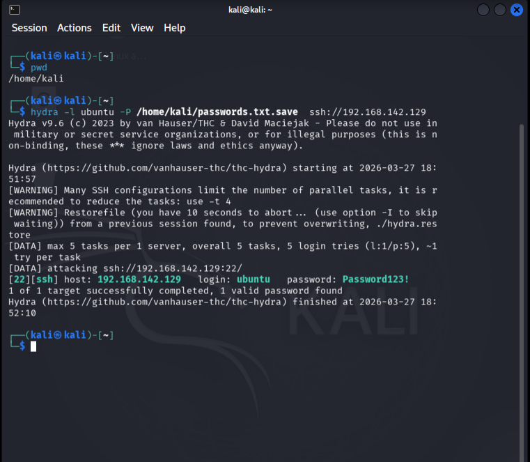

# 🔐 SSH Brute Force Detection & Hardening Lab

## Overview

This project simulates a real-world cybersecurity scenario where a Linux server is targeted by a brute-force SSH attack.

The objective is to demonstrate a full security workflow:

* Enumeration
* Exploitation (brute-force attack)
* Log analysis
* Detection and response
* System hardening

---

## Lab Architecture

The lab consists of three virtual machines:

* **Attacker** → Kali Linux
* **Victim** → Ubuntu Server
* **Admin/Defender** → Ubuntu

Network configuration:

* NAT (internet access)
* Host-Only (internal communication)

---

## Tools & Technologies

* Nmap → Network scanning
* Hydra → Brute-force attack
* Fail2Ban → Intrusion prevention
* OpenSSH → Remote access
* Linux Logs (`auth.log`) → Log analysis

---

## Phase 1 — Enumeration

The network was scanned to identify active hosts and open services.

Key finding:

* SSH service exposed on port 22

---

## Phase 2 — Brute Force Attack

A controlled brute-force attack was performed using Hydra.

📸 **Successful Attack**


Result:

* Valid credentials discovered
* Unauthorized access obtained

---

## Phase 3 — Log Analysis

Authentication logs were analyzed to identify attack patterns.

📸 **Log Evidence**


Key observations:

* Multiple failed login attempts
* Repeated attempts from the same IP address
* Successful login after brute force

---

## Phase 4 — Detection (Fail2Ban)

Fail2Ban was configured to automatically block suspicious activity.

📸 **Blocked Connection**


📸 **Banned IP**


Result:

* Attacker IP automatically banned
* Brute-force attack stopped

---

## Phase 5 — SSH Hardening

The system was secured by implementing:

* SSH key-based authentication
* Disabled password login
* Disabled root login

📸 **Secure SSH Access**


📸 **SSH Configuration**


---

## Final Security State

After applying defensive measures:

* Brute-force attacks are no longer effective
* Unauthorized access is prevented
* Only authorized users can connect via SSH keys

---

## Key Learnings

* How brute-force attacks work in practice
* How to analyze authentication logs
* How to detect and block attacks using Fail2Ban
* How to secure SSH using best practices

---

## Future Improvements

* Configure UFW firewall rules
* Change default SSH port
* Centralized log monitoring
* Automated alerting system

---

## Project Structure

```bash
notes/
screenshots/
README.md
```

---

## Summary

This project demonstrates a complete attack and defense cycle in a controlled lab environment.

It highlights the importance of:

* Proper system configuration
* Monitoring and detection
* Security hardening

---
