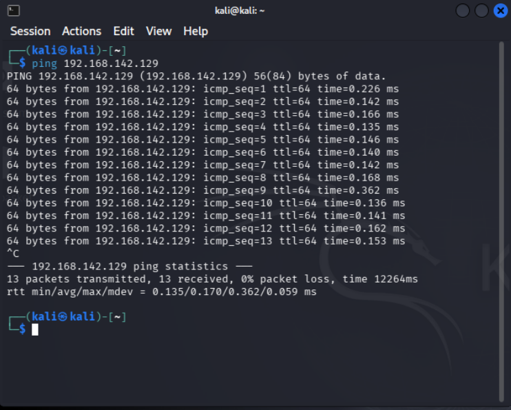

# Network Setup Phase

## Lab architecture
- Attacker: Kali Linux
- Victim: Ubuntu Server
- Defender: Ubuntu Server

## Network Configuration
- Nat: internet access
- Host-Only: internet communication between lab machines

## IP Addresses
- Victim: 192.168.142.129
- Attacker: 192.168.142.130
- Defender: 192.168.142.131

## Connectivity Test
- Ping successful between all machines

## Connectivity Verification

A successful ICMP test was performed from the attacker machine to the victim:

