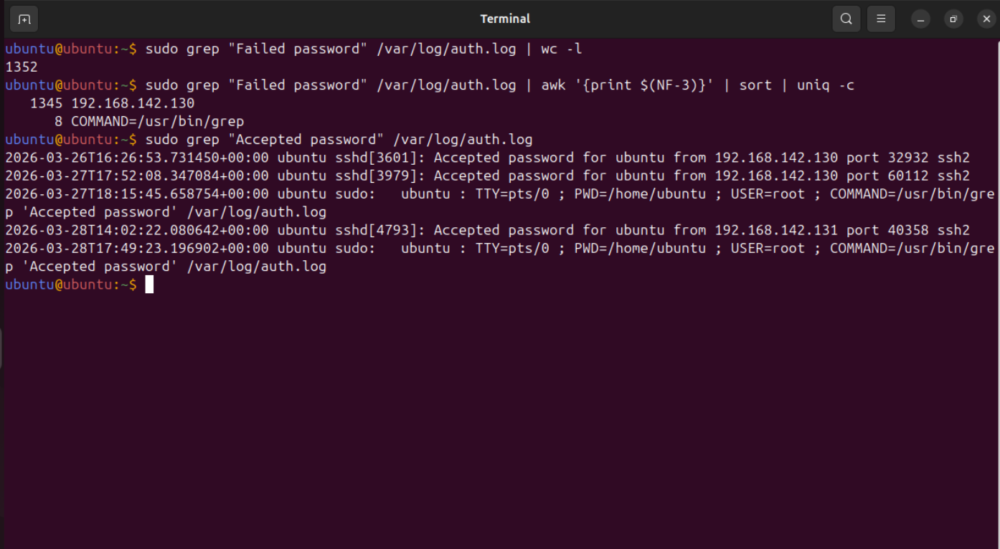
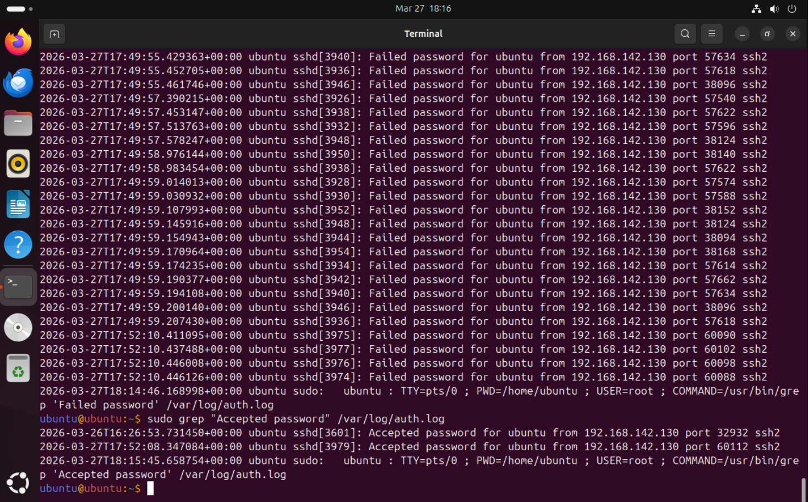

# Log Analysis Phase

## Objective
Analyze authentication logs generated during the brute-force attack.

## Log File

- /var/log/auth.log

## Observations
The log file shows multiple failed SSH authentication attemps coming from the attacker machine.
After several failed attemts, a successful login entry appears for the same source IP.

## Relevant Events
- Failed password entries
- Accepted password entry
- Source IP of the attacker identified in the logs

## Quantitative analysis
The authentication logs were further analyzed to quantify the brute-force activity.

- Total failed login attempts: 1352
- Source IP: 192.168.142.130
- All attempts originated from a single IP address

A successful login was observed after multiple attempts from the same IP, confirming a brute-force attack.

## Conclusion
The authentication logs show multiple failed login attempts originating from the same IP address.
This behavior is indicative of a brute-force attack, as reported login attempts from a single source are considered suspicious.
The source IP can be identified as the attacker machine within the lab environment.
Last detail: No evidence of multiple source IP addresses was found, indicating a non-distributed brute force attack.

## Evidence

### Log Evidence

### Quantitative Analysis

