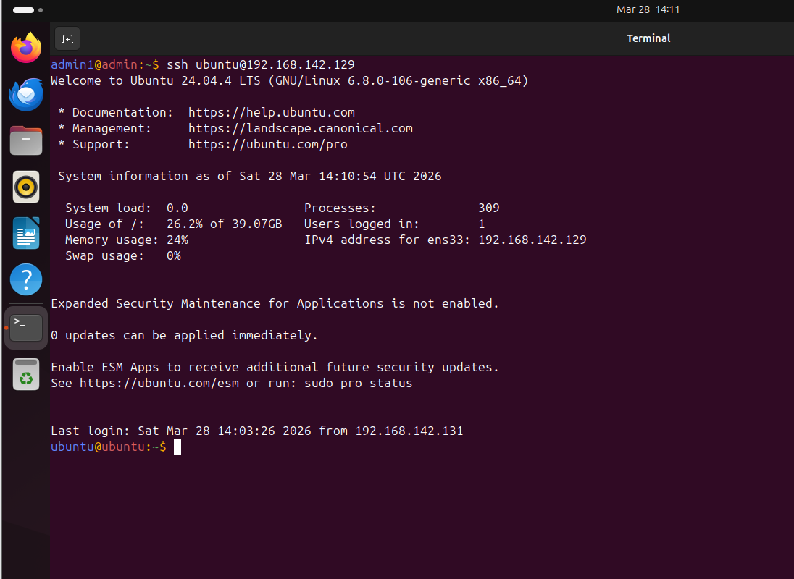
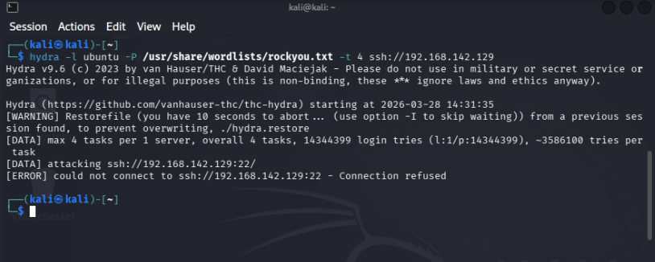
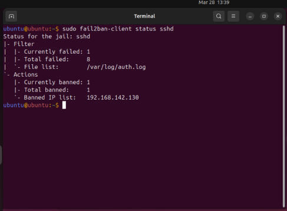
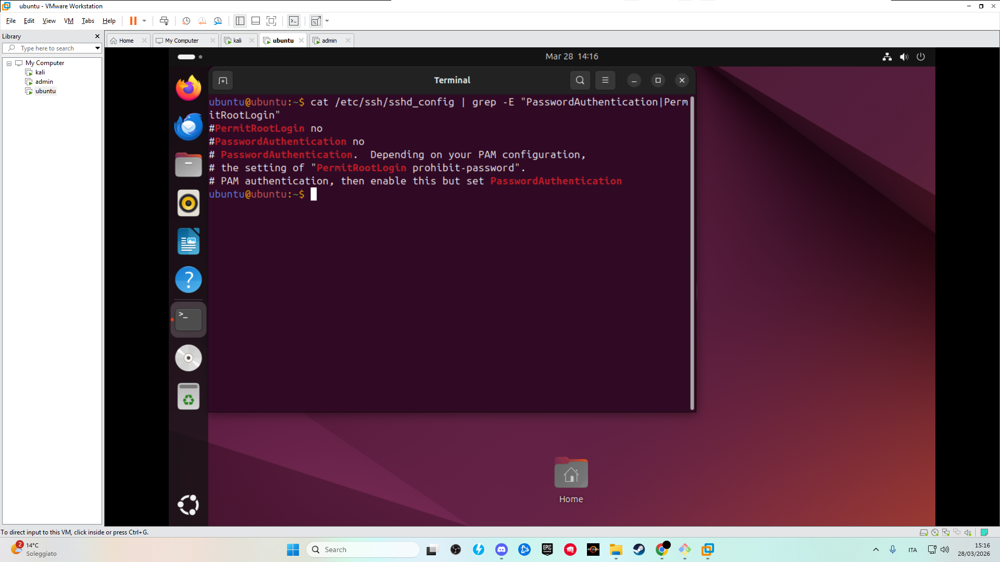

# Final Security State

## Objective

Demonstrate the final secured configuration of the system after applying defensive measures.

## Security Improvements Implemented

### 1. Fail2Ban Protection

- Configured to detect and block brute-force attempts
- Automatically bans IP addresses after multiple failed login attempts

### 2. SSH Hardening

- Disabled password authentication
- Disabled root login
- Enabled key-based authentication only

### 3. Secure Access

- Administrative access is now performed using SSH keys
- No password-based login is allowed

## Result

The system is no longer vulnerable to brute-force attacks:

- Unauthorized login attempts are blocked
- Attacker IP addresses are automatically banned
- SSH access is restricted to authorized user only

## Security Impact

These measures significantly reduce the attack surface and improve the overall security posture

Brute-force attacks are no longer effective against the SSH service.

## Evidence

### SSH Key Login (Secure Access)

### Fail2ban Blocking Attack

### Banned Attacker IP

### SSH Hardening Configuration

